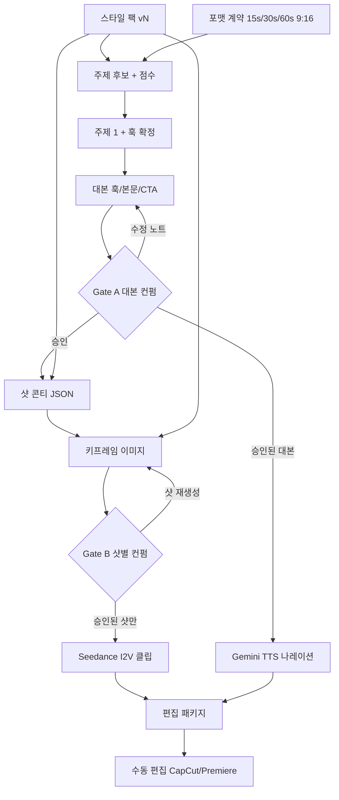

# AI 숏츠 반자동화 파이프라인

Gemini(기획·이미지·TTS)와 Seedance(클립)로 **프리프로덕션까지 자동화**하고, 컷 편집·음악·업로드는 사람이 하는 운영안이다.

## 한 줄 결론

원래 구상(스타일 → 주제 → 콘티 → 컨펌 → 클립 → 수동 편집)을 그대로 쓰되, **컨펌을 두 번** 넣고 클립은 **한 편의 30초 생성이 아니라 승인된 샷만 이미지→영상(I2V)** 으로 뽑는 쪽이 품질·비용·수정 모두에서 낫다.

영상 생성은 비싸고 수정이 어렵다. 싼 산출물(대본, 키프레임)에서 결정을 끝내고, 편집 프로그램에는 **샷 MP4 + 나레이션 WAV + SRT + 샷리스트**만 넘긴다.

## 원래 구상과 첨언

| 원래 단계 | 유지 | 첨언 |
| --- | --- | --- |
| 스타일 정립 | 유지 | 영상마다 다시 만들지 않는다. 버전 있는 **스타일 팩**으로 고정한다. |
| 주제 선정 | 유지 | 아이디어 배치 생성 → 점수 → **로그라인 1줄 + 훅 3개**까지가 선정이다. 주제 문장만 고르면 콘티가 흔들린다. |
| 콘티(이미지, 나레이션) | 유지 | **대본**과 **샷 콘티**를 분리한다. 이미지는 이 단계에서 키프레임으로 뽑고, 이후 Seedance의 첫/끝 프레임이 된다. |
| 컨펌 | 유지, 2단화 | **Gate A 대본** (거의 공짜) → **Gate B 키프레임+샷** (중간) → 그 다음에만 클립. 샷 단위 승인/재생성. |
| 클립 제작 | 유지 | 9:16, 샷당 4–8초 I2V. Seedance 내장 음성은 끄고, 나레이션은 Gemini TTS로 따로 뽑는다. |
| 나머지 수동 편집 | 유지 | 음악 비트, 펀치라인 타이밍, 브랜드 문장, 업로드는 사람이 더 빠르다. |

추가로 넣는 단계:

- **채널 포맷 계약** — 길이, 훅 시간, 자막 세이프존, 금지 표현. 스타일 팩에 포함.
- **대본 단계** — 콘티 앞에 둔다. 화면 없이 듣기만 해도 되는 말부터 확정.
- **팩트/출처 게이트** — 지식·투자·뉴스형이면 대본 컨펌 전에 주장마다 출처. 저장소의 [30년물·AI 자본 브리핑](../reports/README.md)은 첫 파일럿 주제로 쓰기 좋다. 스킵하면 나중에 영상을 버려야 한다.
- **자동 QC** — 키프레임·클립에 글자 깨짐, 비율, 인물 붕괴, 침묵을 Gemini 비전으로 걸러 재생성.
- **편집 패키지** — 썸네일 후보, 제목/설명/해시태그, 샷리스트 CSV까지 같이 뽑는다. 업로드 자동화는 품질이 안정된 뒤로 미룬다.

## 권장 파이프라인



핵심은 **오른쪽(클립)으로 가기 전에 왼쪽에서 락**을 거는 것이다. 클립을 먼저 뽑고 말을 얹으면 길이가 안 맞는다.

## 단계별

### 0. 채널 포맷 + 스타일 팩 (자주 안 바꿈)

스타일 정립은 “이번 영상 분위기”가 아니라 **채널의 재사용 자산**이다. 여기가 흔들리면 이후 API 호출이 전부 낭비다.

스타일 팩에 넣을 것:

- 비주얼: 레퍼런스 이미지 3–6장, 팔레트, 조명, 카메라(고정/핸드헬드/줌), 금지(워터마크, 가짜 자막, 실사 유명인 얼굴).
- 캐릭터/소품: 고정 캐릭터가 있으면 시트(정면·측면·전신). Seedance `reference_image`로 계속 넣는다.
- 카피: 말투, 호칭, 금지 주장(“무조건 오른다” 등), 훅 공식.
- 보이스: Gemini TTS 보이스 이름, 속도, 에너지. 한 채널 = 한 목소리.
- 모션: 샷 길이 4–6초, 컷 밀도, 텍스트 온스크린 여부(가능하면 **영상 안 글자는 만들지 않고** 편집에서 자막으로).
- 포맷: 9:16, 1080×1920, 목표 28–35초, 첫 1.5초에 훅, 하단 자막 세이프존.

버전을 남긴다. `style-pack.v1.yaml` → 반응이 좋으면 v2. 매 회차 즉흥 프롬프트로 스타일을 다시 쓰지 않는다.

### 1. 주제 선정

Gemini에 스타일 팩 + 최근 업로드 목록 + (선택) 검색 그라운딩을 주고 **한 번에 15–20개**를 뽑은 뒤 점수로 고른다.

점수 축 예시:

- 훅 강도 (첫 문장이 멈추게 하는가)
- 시각화 가능성 (추상 개념만 있으면 비용↑ 품질↓)
- 차별성 (이미 많이 나온 각도인가)
- 리스크 (팩트 검증 난이도, 정책)
- 길이 적합성 (30초에 끝나는가)

선정 산출물은 제목이 아니라 아래 네 줄이다.

1. 로그라인 1문장
2. 훅 후보 3개 (이 중 하나를 Gate A에서 고른다)
3. 시청자가 끝나고 남는 한 문장
4. 시각 메타포 1개 (예: 저울, 모래시계, 두 갈래 길)

지식·투자 채널이면 여기서 “검증 가능한 주장 / 의견 / 비유”를 표시해 둔다.

### 2. 대본 — Gate A

콘티보다 먼저 말을 확정한다. 숏츠는 그림보다 **첫 2초 대사와 자막**이 이탈을 가른다.

구조:

1. 훅 0–2초
2. 본문 3–4 비트 (비트당 한 샷)
3. 반전 또는 숫자 한 개
4. CTA 1줄 (구독 강요보다 “저장용 한 줄”)

한국어 길이 가늠: 또박또박 나레이션이면 **초당 6–8자(공백 제외)** 전후. 30초면 본문 약 180–240자. 더 길면 말이 화면을 덮는다.

Gate A에서 고칠 것: 사실, 훅, 금지 표현, 길이. 카메라 워크는 아직 보지 않는다.

대본이 잠기면 TTS를 돌려 **실제 길이**를 재는 것이 이상적이다. 샷 길이는 이 숫자에 맞춘다. MVP에서는 글자 수로 추정하고, 편집에서 맞추는 것도 가능하다.

### 3. 콘티 + 키프레임 — Gate B

콘티는 그림 설명이 아니라 **기계가 실행할 샷 리스트**다. 사람 검토용 스토리보드와 API 입력을 같은 JSON에서 만든다.

샷 하나당:

- `id`, 목표 초, 카메라
- 나레이션 한 줄 (대본과 1:1)
- 온스크린 자막 (편집에서 올릴 텍스트, 이미지에 그리지 않음)
- 비주얼 프롬프트 (스타일 팩을 전제로 한 **이 샷만의 차이**)
- `first_frame` / `last_frame` 생성 여부
- SFX 힌트, 전환 (컷/스와이프)

그다음 Gemini 이미지(Nano Banana 계열)로 키프레임을 뽑는다. 여기서 스타일 팩 레퍼런스를 항상 첨부한다.

왜 클립 전에 이미지를 만드는가:

- 이미지 한 장이 영상 4–8초보다 싸고 빠르다.
- Seedance는 **첫 프레임 + (가능하면) 끝 프레임** I2V가 텍스트만으로 30초를 뽑는 것보다 통제가 된다.
- 사람은 움직이는 클립 10개보다 정지 컷 6장을 더 정확히 고른다.

Gate B는 **영상 전체가 아니라 샷 단위**다. “3번만 다시, 배경을 더 단순하게”가 되도록 리뷰 UI를 둔다.

### 4. 클립 제작

승인된 샷만 Seedance에 넣는다.

권장 설정:

- 비율 `9:16`, 초안 `720p`, 쓸 샷만 `1080p`
- 길이 4–8초 (모델 한도 안의 짧은 샷)
- `generate_audio: false` — 내장 보이스/BGM이 나중에 나레이션과 싸운다
- 입력: 텍스트 모션 프롬프트 + `first_frame` (+ 필요 시 `last_frame`) + 스타일 `reference_image`
- 실사 유명인 얼굴 금지. 가상 캐릭터면 제공 쪽 가이드(가상 아바타 플래그 등)를 따른다

한 샷이 마음에 안 들면 그 샷만 재생성한다. 30초 원테이크 재생성보다 이 방식이 편집 전제와 맞다.

Seedance 2.5의 30초 원패스는 **이미 콘티가 안정된 뒤**, “한 장면 롱테이크”가 필요할 때만 쓴다. 초반 파이프라인의 기본값으로 두지 않는다.

Veo(Gemini 영상)는 대체가 아니라 **비교 렌더러**로 둔다. 대사·립싱크가 중요한 샷만 샘플 비교하고, 나머지는 Seedance I2V로 통일하는 편이 스타일이 덜 깨진다.

### 5. 나레이션·자막·편집 패키지

- 나레이션: Gemini TTS. 스타일 팩의 보이스/속도를 고정. 샷별 WAV + 전체 합본.
- 자막: 대본에서 SRT 초안. 초반엔 편집기에서 밀어도 된다. 나중에 강제 정렬로 단어 타이밍을 붙인다.
- 자동으로 같이 뽑을 것: 썸네일 후보 3장(키프레임 크롭), 제목 5개, 설명, 해시태그, 샷리스트 CSV.
- 폴더 통째로 CapCut/Premiere에 넣는다.

수동 편집에서 할 일(자동화하지 않음):

- BGM 비트에 컷 맞추기
- 훅 샷 길이 0.3초 단위 트리밍
- 자막 강조(키워드 색)
- 정책·톤 최종 확인
- 업로드

## API 역할

| 역할 | 모델 | 이유 |
| --- | --- | --- |
| 주제, 대본, 콘티 JSON, 제목, QC | Gemini 텍스트 (Pro급) | 구조화 출력, 긴 컨텍스트, 수정 노트 반영 |
| 팩트 보강 | Gemini + 검색 그라운딩 | 지식형 숏츠의 환각을 여기서 막음 |
| 키프레임·썸네일 | Gemini 이미지 (Nano Banana 2 계열) | 콘티 단계 반복이 저렴 |
| 클립 | Seedance 2.0/2.5 I2V | 9:16, 첫/끝 프레임, 레퍼런스 이미지 |
| 비교용 클립 | Veo 3.1 Fast | 필요할 때만. 기본 경로 아님 |
| 나레이션 | Gemini TTS | 보이스 고정, 샷별 생성, 스타일 프롬프트 |

호출 패턴은 전부 **비동기 작업 + 폴링 + 샷 단위 재시도**로 짠다. 영상 API를 동기처럼 기다리면 파이프라인이 자주 죽는다.

## 산출물 계약

한 편 = 폴더 하나. 프롬프트 채팅 로그가 아니라 아래 파일이 소스 오브 트루스다.

```
style-packs/v1.yaml
projects/2026-08-18-us-30y-hook/
  brief.json          # 주제, 훅, 메타포, 리스크
  script.json         # Gate A
  storyboard.json     # 샷 리스트
  review.json         # 샷별 승인/노트
  frames/shot-03.png
  clips/shot-03.mp4
  audio/shot-03.wav
  captions.srt
  package/shotlist.csv
```

예시 파일은 `shorts/examples/`에 있다. 오케스트레이터는 이 JSON만 읽고 쓴다.

리뷰는 웹앱이 아니어도 된다. `storyboard.json` + 키프레임으로 정적 HTML을 만들어 브라우저에서 샷별 승인하는 것이 MVP다.

## 자동화 범위

**지금 자동화**

스타일 적용, 주제 배치, 대본, 콘티 JSON, 키프레임, 샷별 컨펌 기록, 승인 샷 클립, TTS, SRT 초안, 썸네일·메타데이터.

**사람이 한다**

Gate A/B 판단, 브랜드에 걸리는 문장, 최종 컷, 음악, 업로드.

**나중에**

강제 정렬 자막, BGM 자동 더킹, 플랫폼 예약 업로드, 성과를 주제 점수에 피드백.

처음부터 올인원 웹앱을 만들지 않는다. 먼저 **CLI + 폴더 + 리뷰 HTML**로 10편을 돌려 보고, 막히는 단계만 UI로 올린다.

## MVP 구현 순서

1. 스타일 팩 YAML 한 개와 포맷(30초, 9:16)을 손으로 적는다.
2. Gemini 구조화 출력으로 `brief` → `script` → `storyboard`를 잇는다.
3. 키프레임 생성 + 로컬 리뷰 HTML.
4. 승인 샷만 Seedance I2V (`generate_audio: false`).
5. Gemini TTS + SRT 초안 + 샷리스트를 `package/`에 모은다.
6. 같은 스타일 팩으로 10편 돌리며 프롬프트와 샷 길이를 고정한다.

이 순서에서 3번(키프레임 컨펌) 없이 4번으로 건너가면 비용이 바로 샌다.

## 비용·품질·리스크

- **비용:** 텍스트·TTS는 저렴, 이미지는 중간, 영상이 대부분이다. Gate B 이전 폐기는 싸고, 클립 폐기만 비싸다. 초안 720p, 확정 샷만 1080p.
- **일관성:** 매 호출에 스타일 팩 레퍼런스를 넣는다. 텍스트 프롬프트만으로 캐릭터를 유지하려고 하지 않는다. 영상 속 글자는 거의 깨지므로 자막은 편집에서 올린다.
- **오디오:** 지식형은 **VO 분리**가 기본이다. Seedance 네이티브 오디오는 분위기 B-roll에만.
- **정책:** 실존 인물 얼굴, 로고, 저작권 음악, 투자 단정 표현. 지식형은 화면에 “의견/과거 데이터”를 자막으로 남길지 대본 단계에서 정한다.
- **운영:** 샷당 재시도 한도(예: 2회)와 실패 시 스킵하고 리뷰로 돌려보내기를 기본값으로 둔다.

## 바로 시작할 때

다음 세 가지만 정하면 파이프라인을 열 수 있다.

1. 채널 한 줄 (예: “30초 경제 메커니즘 숏츠”)
2. 레퍼런스 이미지 3장 + TTS 보이스 하나
3. 첫 주제 한 개와 훅 한 줄

그다음 작업은 스타일 팩을 채우고, Gate A/B가 되는 리뷰 HTML과 Seedance I2V 호출을 붙이는 것이다. 스키마 예시는 `shorts/examples/`를 본다.
