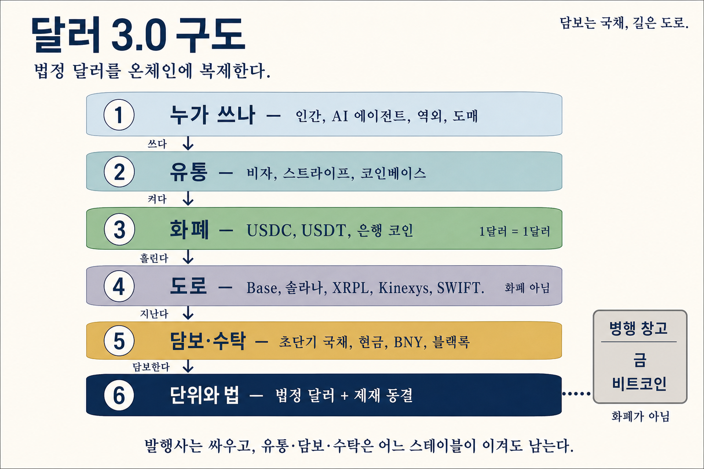
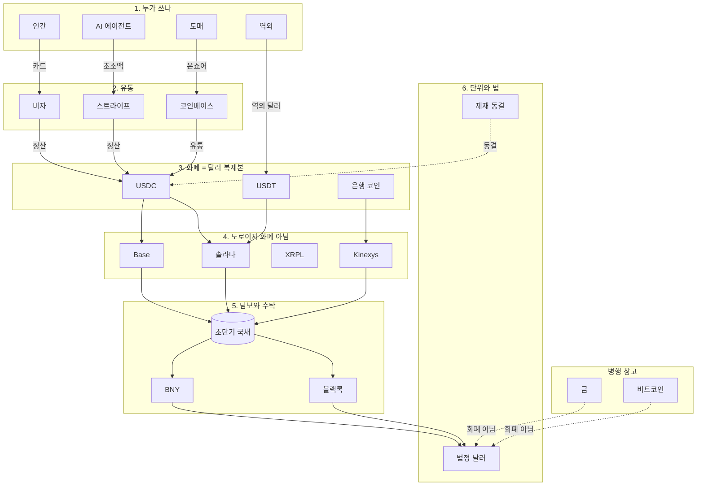
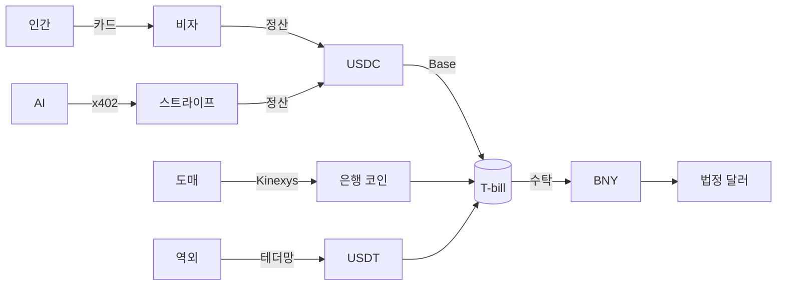

# 달러 3.0 구도

- 날짜: 2026-08-27
- 상태: active
- 한 줄: 위는 누가 쓰나, 가운데는 달러 복제본, 아래는 국채와 법이다
- 선행: [가정 평가](./assumption-audit.md), [플레이어 10](./dollar-3-players.md)

이 메모는 매수·매도 지시가 아니다. 달러 3.0을 층으로 읽는다.

편집용 FigJam: [달러 3.0 구도](https://www.figma.com/board/7IEGWTjWBDCmlf1N6Fez4n)



## 한 장으로

위가 사용자, 아래가 법이다. 돈이 아래로 내려갈수록 달러에 가까워진다.



| 층 | 하는 일 | 지금 이름 | 혼동하지 말 것 |
| --- | --- | --- | --- |
| 1 누가 쓰나 | 돈을 써야 하는 주체 | 인간, AI 에이전트, 역외, 도매 | AI가 담보가 아니다 |
| 2 유통 | 켜고 꽂고 정산한다 | 비자, 스트라이프, 코인베이스 | 발행사가 갈려도 이 문은 남는다 |
| 3 화폐 | 1달러짜리 복제본 | USDC, USDT, 은행 코인 | 가격이 오르는 알트가 아니다 |
| 4 도로 | 복제본이 지나가는 길 | Base, 솔라나, XRPL, Kinexys, SWIFT | 도로의 통행료 토큰이 기축이 아니다 |
| 5 담보·수탁 | 복제본을 국채·현금에 앉힌다 | T-bill, BNY, 블랙록 | 담보는 금·원유·비트가 아니다 |
| 6 단위와 법 | 이름을 달러로 남기고 동결한다 | 법정 달러, 제재 | 제재를 포기하는 체제가 아니다 |
| 옆 창고 | 보험으로 쌓아 둔다 | 금, 비트코인 | 창고는 화폐가 아니다 |

## 틀린 그림, 맞은 그림

틀린 그림은 담보를 죽여 가며 기축을 교체한다.

```text
금  ──죽임──▶  원유  ──죽임──▶  BTC · ETH · SOL · XRP
```

맞은 그림은 같은 달러가 배관만 바꾼다.

```text
누가 쓰나
   │  쓰다
유통 (비자 · 스트라이프 · 코인베이스)
   │  켜다
화폐 (USDC · USDT · 은행 코인)
   │  흘린다
도로 (Base · 솔라나 · XRPL · Kinexys)
   │  지난다
담보 (초단기 국채 · 현금 · BNY · 블랙록)
   │  담보한다
단위와 법 (법정 달러 + 제재)
        ╎
        ╎ 화폐 아님
   금 · 비트코인
```

## 한 번의 결제가 앉는 곳

사람이 카드를 긁으면 비자가 앞에서 받고, 뒤에서 USDC가 Base를 지나 초단기 국채에 앉는다. AI가 초소액을 내면 스트라이프가 받아 솔라나 위 USDC로 같은 국채에 앉는다. 도매는 JP모건 허가형 원장, 역외는 테더. 도착지는 네 길 모두 **T-bill과 법**이다.



발행 칸은 서클·테더·은행·Open USD가 싸운다. 싸움의 위와 아래 — 유통, 담보, 수탁, 법 — 는 누가 이겨도 남는다.

작성 기준일은 2026년 8월 27일이다. 특정 자산의 매수·매도를 권유하지 않는다.
